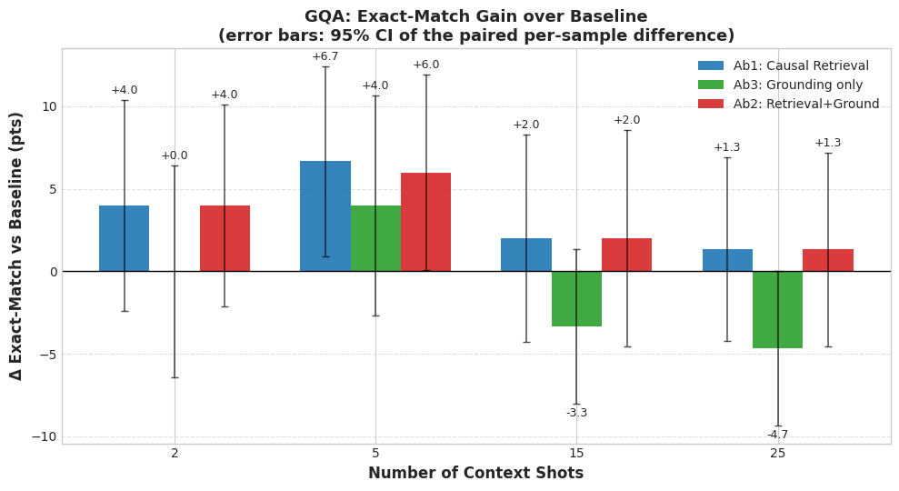
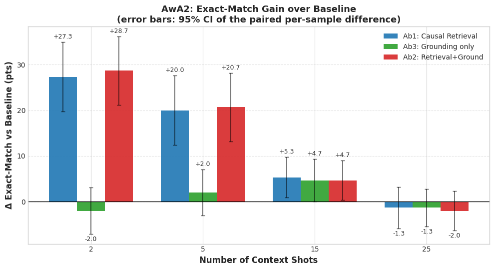
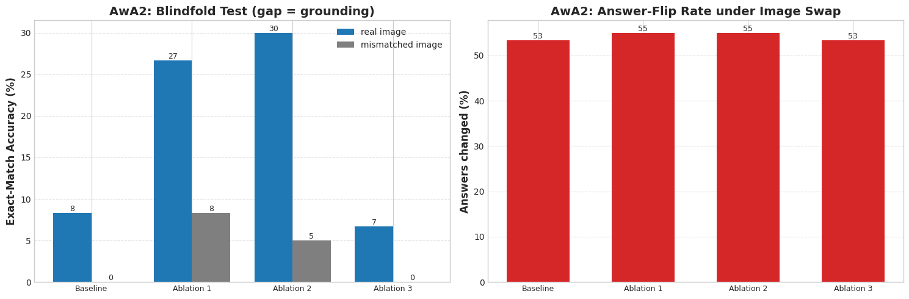
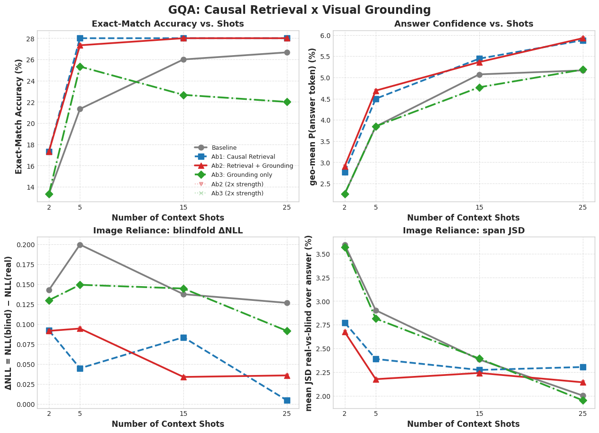
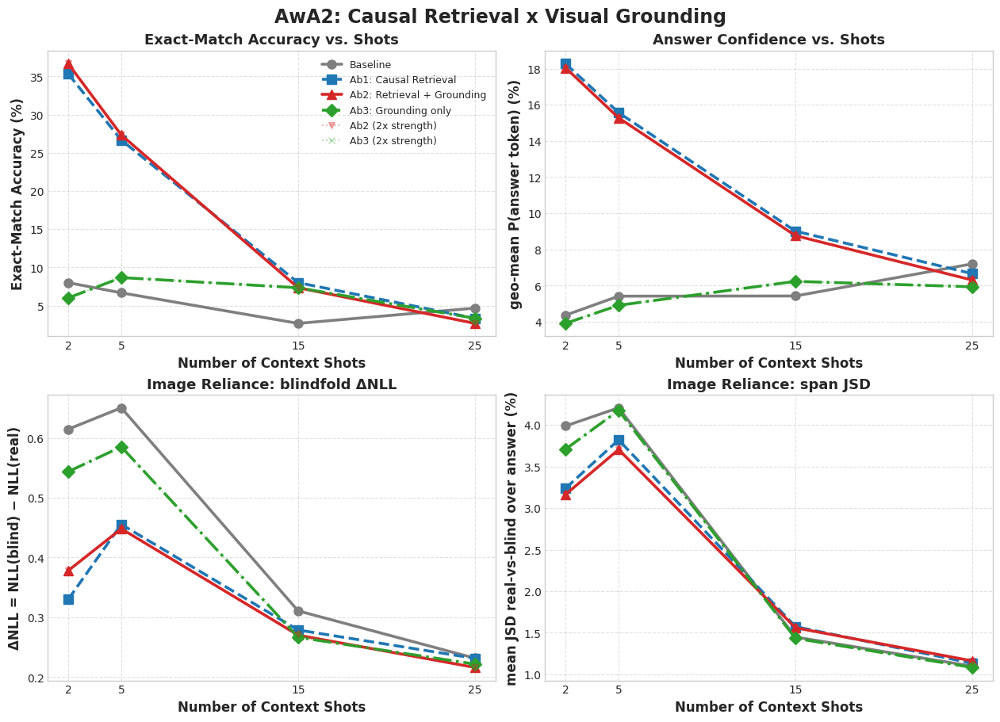

# Project-X: Forcing Visual Grounding

**Causal-Aware Few-Shot Learning in Vision-Language Models via Counterfactual Retrieval and Attention Modulation**

Simone Cama (ID 2044010) — Computer Vision, A.Y. 2025/2026

---

## Idea

Vision-Language Models (VLMs) can learn new tasks **In-Context** from a few interleaved
image–text demonstrations, but the paradigm is fragile in three ways:

1. **Modality imbalance** — In-Context Learning is driven mostly by the *text* of the
   demonstrations; the images have a near-negligible effect (weak cross-attention).
2. **Spurious correlations in retrieval** — standard RICES selects demonstrations by *passive* similarity, retrieving visually correlated but **non-causal** examples.
3. **The many-shot paradox** — adding *more* in-context examples eventually **hurts** performance.

This project forces the model to ground its answer in **causal visual evidence** with a
**dual novelty** on top of an [OpenFlamingo-3B](https://huggingface.co/openflamingo/OpenFlamingo-3B-vitl-mpt1b) baseline:

- **(1) Causal-Mixed Retrieval.** Demonstrations are scored with a tri-weighted cosine similarity over a *region* crop, the *question* text, and the *global* image, then filtered for class diversity and clamped to a bounded shot window.

- **(2) Cross-Modal Attention-Forcing Penalty.** A small LoRA adapter on the gated cross-attention is trained with a counterfactual grounding loss — swapping in the *wrong* image must raise the answer loss by a margin — plus an attention-entropy term.

Everything is evaluated with a **2×2 factorial ablation** (causal vs. random retrieval × adapter ON/OFF).

---

## Results at a glance

**Causal retrieval is the accuracy driver** — exact-match gain over the OpenFlamingo baseline at every shot level; on AwA2 the 2- and 5-shot gains pass an exact paired McNemar test at p<0.001 (error bars: 95% CI of the paired per-sample difference):

<p align="center">
  
  
</p>

**The grounding adapter drives causality** — with the adapter ON, the blindfold gap (EM with the real query image minus EM with a mismatched one) triples on AwA2 (+8.3 → +25.0), at no accuracy cost and 0.12% trained parameters:

<p align="center">
  
</p>

**Full evaluation panels** — EM, answer confidence, blindfold ΔNLL, and span-JSD vs. number of shots, for the whole 2×2 ablation:

<p align="center">
  
  
</p>

---

## Repository structure

```
CV_project/
├── README.md
├── proposal/
│   └── proposal.pdf
├── src/
│   └── project_x_iclp_pipeline.ipynb
├── presentation/                    
│   ├── project_x_presentation.pdf
│   └── figures/                  # all plots exported by the notebook
```

- [proposal/proposal.pdf](proposal/proposal.pdf) — the original project proposal.
- [src/project_x_iclp_pipeline.ipynb](src/project_x_iclp_pipeline.ipynb) — the complete, reproducible pipeline (loads the data and models, runs the brief LoRA grounding phase, then the 2×2 ablation + diagnostics, and renders every plot).
- [presentation/project_x_presentation.pdf](presentation/project_x_presentation.pdf) — the slides.

---

## Datasets

All datasets are streamed from the Hugging Face Hub (no manual download required by the notebook).

| Dataset | Role | Split used | Link |
|---|---|---|---|
| **VQAv2** | Train the grounding adapter (general VQA, no benchmark leakage) | `validation`, 2000 shuffled samples | [lmms-lab/VQAv2](https://huggingface.co/datasets/lmms-lab/VQAv2) |
| **GQA** | Zero/few-shot evaluation — compositional spatial reasoning | `testdev_balanced` | [lmms-lab/GQA](https://huggingface.co/datasets/lmms-lab/GQA) |
| **AwA2** (Animals with Attributes 2) | Zero/few-shot evaluation — attribute-grounded recognition | `test` | [KRadim/AwA-Pose-Lite](https://huggingface.co/datasets/KRadim/AwA-Pose-Lite) |


## Models

| Model | Use | Link |
|---|---|---|
| **OpenFlamingo-3B** (CLIP ViT-L/14 + MPT-1B) | VLM baseline (LoRA grounding adapter on its cross-attention) | [openflamingo/OpenFlamingo-3B-vitl-mpt1b](https://huggingface.co/openflamingo/OpenFlamingo-3B-vitl-mpt1b) |
| **MPT-1B RedPajama** | Language backbone inside OpenFlamingo | [anas-awadalla/mpt-1b-redpajama-200b](https://huggingface.co/anas-awadalla/mpt-1b-redpajama-200b) |
| **CLIP ViT-B/32** | Retrieval feature extractor (RICES-standard) | [openai/clip-vit-base-patch32](https://huggingface.co/openai/clip-vit-base-patch32) |

---

## Reproducing

### Notebook
Open [src/project_x_iclp_pipeline.ipynb](src/project_x_iclp_pipeline.ipynb) and run top to bottom (a CUDA GPU is recommended). The first cell installs the dependencies.

---

## References

Key papers:

- Alayrac et al. *Flamingo: a Visual Language Model for Few-Shot Learning.* NeurIPS, 2022.
- Awadalla et al. *OpenFlamingo.* arXiv:2308.01390, 2023.
- Chen et al. *Understanding and Improving In-Context Learning on Vision-Language Models.* ICLR Workshop, 2024.
- Xiong et al. *Retrieving Counterfactuals Improves Visual In-Context Learning.* arXiv:2603.16737, 2026.
- Oskooei et al. *When Many-Shot Prompting Fails.* arXiv:2510.16809, 2025.
- Hudson & Manning. *GQA.* CVPR, 2019. — Xian et al. *Zero-Shot Learning (AwA2).* IEEE TPAMI, 2018. — Goyal et al. *Making the V in VQA Matter.* CVPR, 2017.
